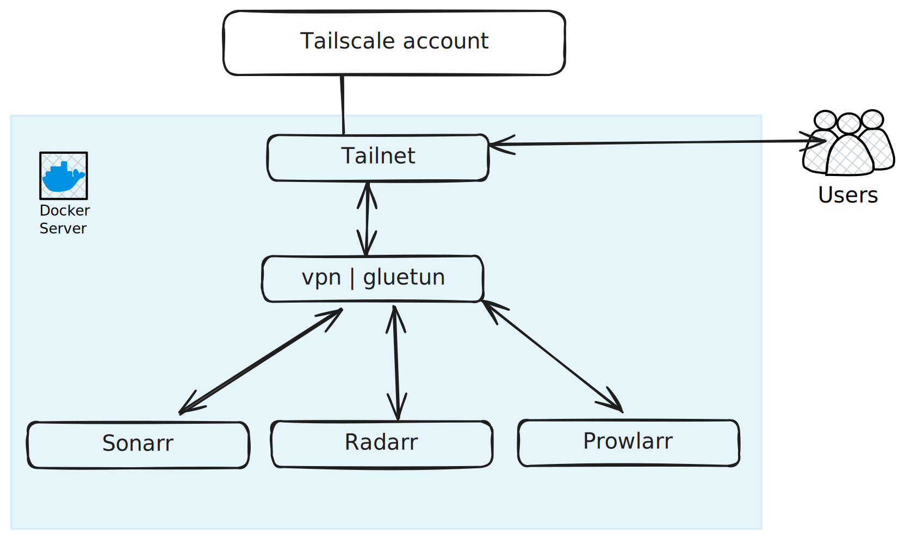

## Description

In this scenario, we will have:

1. one Tailnet instance.
2. one Docker server (with a servarr stack).
3. one Tailscale configuration.

## Scenario



### Server

```yaml  {filename="docker-compose.yaml"}
services:
  tailnet:
    image: tailnet:latest
    user: root
    ports:
      - "8080:8080"
    volumes:
      - <PATH_TO_CONFIG>:/config
      - data:/data
      - /var/run/docker.sock:/var/run/docker.sock
    restart: unless-stopped

  prowlarr:
    container_name: prowlarr
    image: lscr.io/linuxserver/prowlarr:latest
    network_mode: "service:vpn"

  vpn:
    image: qmcgaw/gluetun
    networks:
      tailscale:
        aliases:
          - prowlarr

  prowlarr:
    network_mode: "service:vpn"
```

```yaml  {filename="/config/tailnet.yaml"}
files:
  media:
    filename: /config/media.yaml
    defaultProxyProvider: default
    defaultProxyAccessLog: false
```

```yaml  {filename="/config/media.yaml"}
prowlarr:
  url: http://prowlarr:9696
```