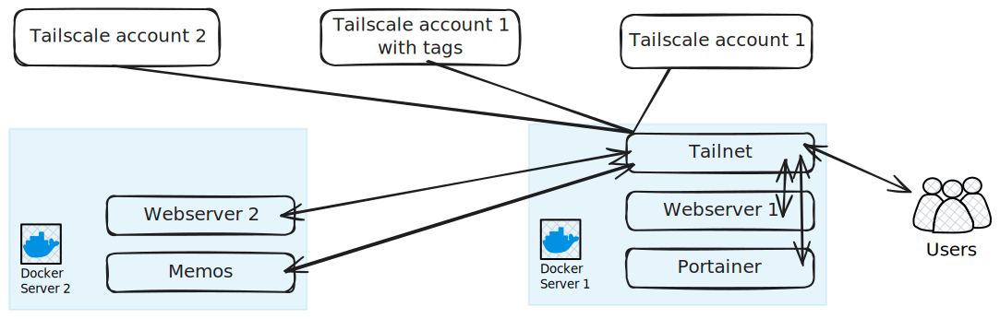

## Description

In this scenario, we will have :

1. two Docker servers.
2. only one Tailnet instance.
3. three Tailscale providers.
4. Containers in SRV1 will use the 'default' provider.
5. Containers in SRV2 will use the 'account2' provider.
6. webserver1 is running in SRV1 but will use the 'withtags' provider.
7. memos is running in SRV2 but will use the 'withtags' provider.

## Scenario



### Server 1

```yaml  {filename="docker-compose.yaml"}
services:
  tailnet:
    image: tailnet:latest
    user: root
    ports:
      - "8080:8080"
    volumes:
      - <PATH_TO_CONFIG>:/config
      - data:/data
      - /var/run/docker.sock:/var/run/docker.sock
    restart: unless-stopped

  webserver1:
    image: nginx
    ports:
      - 81:80
    labels:
      tailnet.enable: true
      tailnet.name: webserver1
      tailnet.provider: withtags
    

  portainer:
    image: portainer/portainer-ee:2.21.4
    ports:
      - "9443:9443"
      - "9000:9000"
      - "8000:8000"
    volumes:
      - portainer_data:/data
      - /var/run/docker.sock:/var/run/docker.sock
    labels:
      tailnet.enable: true
      tailnet.name: portainer
      tailnet.container_port: 9000

volumes:
  data:
  portainer_data:
```

### Server 2

```yaml  {filename="docker-compose.yaml"}
services:
  webserver2:
    image: nginx
    ports:
      - 81:80
    labels:
      - tailnet.enable=true
      - tailnet.name=webserver2

  memos:
    image: neosmemo/memos:stable
    container_name: memos
    volumes:
      - memos:/var/opt/memos
    ports:
      - 5230:5230
    labels:
      tailnet.enable: true
      tailnet.name: memos
      tailnet.container_port: 5230
      tailnet.provider: withtags

volumes:
  memos:
```

## Tailnet Configuration

```yaml  {filename="/config/tailnet.yaml"}
defaultProxyProvider: default
docker:
  srv1: 
    host: unix:///var/run/docker.sock
    defaultProxyProvider: default
  srv2: 
    host: tcp://174.17.0.1:2376
    targetHostname: 174.17.0.1
    defaultProxyProvider: account2
tailscale:
  providers:
    default: 
      authKey: "sdfsdgsdfgdfg"
    withtags:
      authKey: "jujgnndvds"
    account2:
      authKey: "nnnnnnndndnddd"
```
